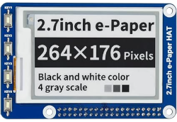

## Clock & Weather with Raspberry PI & E-Paper display

## Some story...

Few years back i have purchased a Raspberry PI HAT : [Waveshare ](https://www.waveshare.com) 2.7 inch E-Paper.

I have coded a Python script in order to display current time and weather using OpenWeatherMap API. The script was running quite good and i used the weather station for long time.

Recently, while shifting home, i have lost the SD card on my RPi with the script inside :cry: ! I have no backup of the script and not willing to redo the same !

Hence, i have decided to write a .Net program for the same purpose and enhanced the functionnalty with some new icons and parameters.

## Drivers

There are no .Net drivers given by the manufacturer. The manufacturer has no plan to write a .Net driver ! (i have mailed to thier support) 

So i have decided to port their python script to .Net and write a small driver to operate the Waveshare E-Paper display HAT.

Also i have been inspired by similar approaches found in github :

| Description                       | Links                                                  |
| --------------------------------- | ------------------------------------------------------ |
| Waveshare wiki                    | https://www.waveshare.com/wiki/7.5inch_HD_e-Paper_HAT_ |
| Waveshare github                  | https://github.com/waveshareteam/e-Paper               |
| aaasoft/WaveShare.EPD             | https://github.com/aaasoft/WaveShare.EPD               |
| eXoCoolLD/Waveshare.EPaperDisplay | https://github.com/eXoCooLd/Waveshare.EPaperDisplay    |

## Weather API

I have used [OpenWeatherMap](https://openweathermap.org/api) API to gather atmospheric and weather details for my current location.

## Application

The application is based on 4 main classes :

- ConfigurationService : Application settings and configuration reader

- LocalWeatherService : Retrieves weather from API

- EPaperDisplay2in7 : E-Paper display driver (ported from python and adapted locally)

- ClockManager : Main application for clock and weather services

The application configuation is located in *appsetting.json*

| Key                                  | Value                                 | Type    |
| ------------------------------------ | ------------------------------------- | ------- |
| JClock:OpenweatherMapApiKey          | <use your own key>                    | String  |
| JClock:OpenweatherMapApiCfgLatitude  | Latitude coordinate of your location  | Decimal |
| JClock:OpenweatherMapApiCfgLongitude | Longitude coordinate of your location | Decimal |
| JClock:OpenweatherMapApiCfgUnits     | default : metric                      | String  |
| JClock:OpenweatherMapApiCfgLanguage  | default : en                          | String  |

### Specifications

My E-Paper display has no partial refresh available. When changing the display we need to clear complete screen and write all the stuffs. The clearing and writing time can  take few hundreds of milliseconds. Hence there is no possibility to update the display rapidly every seconds. Also using a free account on OpenWeatherMap API i have limited numbers of queries for my account per day.

For these reasons, i will refresh the display only every 2 minutes. I have also set an offset of +5 minutes for the display time in order to be on time always :wink: !

### Service mode

Run the application as a service in Rpi OS

`[Unit]
Description=jclock

[Service]
Type=notify
ExecStart=~/dotnet/dotnet /home/kattabomane/jclock/jclock.dll

Environment=DOTNET_ROOT=/usr/lib64/dotnet

[Install]
WantedBy=multi-user.target`

## Ressources

- https://learn.microsoft.com/en-us/troubleshoot/developer/webapps/aspnetcore/practice-troubleshoot-linux/2-3-configure-aspnet-core-application-start-automatically

- https://code-maze.com/aspnetcore-running-applications-as-linux-service/

## Used librairies & fonts

- .Net 8 SDK

- NLog

- SixLabours.Fonts

- SixLabours.ImageSharp

- System.Device.Gpio

- Google font : Roboto-Black

## Final Results

